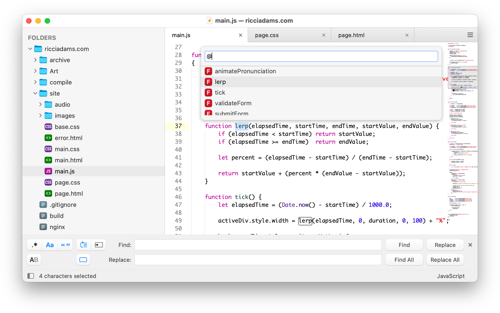

# Theme - Timeless

A light theme for Sublime Text 4 inspired by macOS.

Timeless is the successor to
[El Capitan](https://github.com/iccir/El-Capitan-Theme) and is designed to look great with macOS Yosemite through Sequoia.

## Design

The code font shown in the screenshot is Monaco.  The color scheme is [Xcode-ish](https://gist.github.com/iccir/b999104536ce8211e5e7).

## Installation

Timeless is designed to work with [Sublime Text 4](http://www.sublimetext.com/).

#### Package Control

If you are using [Sublime Package Control](https://packagecontrol.io), you can easily install the theme via `Package Control: Install Package` and then select the  `Theme - Timeless` package.

#### Using Git

Alternatively, if you are a git user, you can install the theme and keep up to date by cloning the repo directly into your `Packages` directory in the Sublime Text application settings area.

You can locate your Sublime Text `Packages` directory by using the menu item `Preferences -> Browse Packages...`.

While inside the `Packages` directory, clone the theme repository using the command below:

    git clone https://github.com/iccir/Timeless-Theme/ "Theme - Timeless"

#### Download Manually

* Download the files using the GitHub .zip download option
* Unzip the files and rename the folder to `Theme - Timeless`
* Find your `Packages` directory using the menu item  `Preferences -> Browse Packages...`
* Copy the folder into your Sublime Text `Packages` directory

## Activating and configuring the theme

To configure Sublime Text to use the theme, follow the instructions below:

* Open your User Settings Preferences file `Sublime Text -> Preferences -> Settings - User`
* Add (or update) your theme entry to be `"theme": "Timeless.sublime-theme"`

**Example Sublime Text User Settings**

    {
        "theme": "Timeless.sublime-theme",
        
        "timeless_use_uppercase_font": false,
        "timeless_hide_goto_symbol_hints": false,
    }

* `timeless_use_uppercase_font` - If `true`, uses the `Timeless Uppercase` font for symbol letters. You will need to manually install [TimelessUppercase.ttf](https://github.com/iccir/Timeless-Theme/raw/refs/heads/main/support/TimelessUppercase.ttf).
* `timeless_hide_goto_symbol_hints` - If `true`, hides hints in the Goto Symbol panel.

## Development

Please note, Sublime Text dev builds move quickly and changes can occur with the theme API between releases, so there may be occasions where the theme doesn't quite work with a brand new dev release.

## License and Acknowledgements

To the extent possible, the files in this repository are [dedicated to the public domain](https://creativecommons.org/publicdomain/zero/1.0/).

That said:

- `Timeless.sublime-theme` is based on the `Default.sublime-theme` file packaged with Sublime Text.

- `Button Icons.sketch` includes vector outlines that were traced from images packaged with Sublime Text.

- `File Icons.sketch` includes vector outlines of various glyphs from [DINish](https://github.com/playbeing/dinish). SIL Open Font License.

- `TimelessUppercase.ttf` uses glyphs from [Roboto Mono](https://fonts.google.com/specimen/Roboto+Mono). SIL Open Font License.
