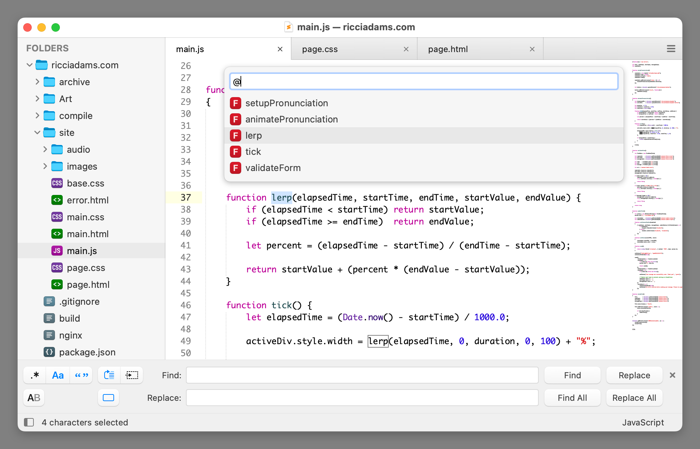
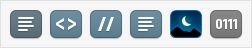
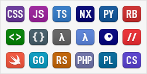

# Theme - Timeless

A theme for Sublime Text 4 inspired by macOS.

Timeless is the successor to
[El Capitan](https://github.com/iccir/El-Capitan-Theme) and is designed to look great with macOS Yosemite through Sequoia.

## Design



The code font shown in the screenshot is Monaco.  The color schemes are [Heirloom](https://gist.github.com/iccir/a78c588bd6cec6b2cec0eedea9462f99) and Mariana.

## Installation

Timeless is designed to work with [Sublime Text 4](http://www.sublimetext.com/).

#### Package Control

If you are using [Sublime Package Control](https://packagecontrol.io), you can easily install the theme via the `Package Control: Install Package` command and then select the  `Theme - Timeless` package.

#### Download Manually

* Download the .zip file for the [latest release](https://github.com/iccir/Timeless-Theme/releases).
* Unzip and rename the folder to `Theme - Timeless`
* Find your `Packages` directory using the menu item  `Preferences -> Browse Packages...`
* Copy the folder into your Sublime Text `Packages` directory

## Activating and configuring the theme

To configure Sublime Text to use the theme, follow the instructions below:

* Open your User Settings Preferences file via `Sublime Text -> Settings -> Settings`
* For the light variant, add or update `theme` to be `"theme": "Timeless.sublime-theme"`.
* For the light variant, add or update `theme` to be `"theme": "Timeless Dark.sublime-theme"`.


### Additional Theme Settings

* `timeless_use_uppercase_font` - If `true`, uses the `Timeless Uppercase` font for symbol letters. You will need to manually install [TimelessUppercase.ttf](https://github.com/iccir/Timeless-Theme/raw/refs/heads/main/extras/TimelessUppercase.ttf). Defaults to `false`.

* `timeless_hide_goto_symbol_hints` - If `true`, hides hints in the Goto Symbol panel. Defaults to `false`.

* `timeless_use_file_icon_overlay` - If `true`, adds an additional shadow to file icons in dark mode. This improves contrast but may conflict with [AFileIcon](https://github.com/SublimeText/AFileIcon) icons. Defaults to `true`.


### Example Settings File

```json
{
    "theme": "Timeless.sublime-theme",

    "timeless_use_uppercase_font": false,
    "timeless_hide_goto_symbol_hints": false,
    "timeless_use_file_icon_overlay": true,
}
```

## Activating additional icons

Sublime Text's implementation of file icons is very fragile. If *any* installed theme defines custom file icons, it can break the icon for that file type in other themes (see [Issue 6](https://github.com/iccir/Timeless-Theme/issues/6)).

To be a good citizen of the ecosystem, Timeless will not use language-specific icons by default and will only include icons for the built-in types:



To activate additional icons, run the `Timeless - Install icon support` command via the [command palette](https://docs.sublimetext.io/guide/extensibility/command_palette.html). This will add a `Caches/Timeless Icon Support` folder with the support files necessary to enable additional language-specific icons:



Sublime Text also has issues differentiating C++ header files from C++ implementation files. By default, both will share the same icon. Hence, Timeless uses an asterisk character (to represent a C pointer) rather than a file extension for the C language family:


For alternate icons, run the `Timeless - Install icon support (with C letters)` command:


This command will install `C++ Header.sublime-syntax` and `C++ Header.sublime-settings` into the `Caches/Timeless Icon Support` folder. It will also modify `Packages/User/C++.sublime-settings`.

To revert back to the default state, run the `Timeless - Remove icon support` command. This should fix broken icons in other themes.

Timeless is also compatible with [AFileIcon](https://github.com/SublimeText/AFileIcon) for icon management.


## License and Acknowledgements

To the extent possible, the files in this repository are [dedicated to the public domain](https://creativecommons.org/publicdomain/zero/1.0/).

That said:

- `Timeless.sublime-theme` is based on the `Default.sublime-theme` file packaged with Sublime Text.

- `Button Icons.sketch` includes vector outlines that were traced from images packaged with Sublime Text.

- `File Icons.sketch` includes vector outlines of various glyphs from [DINish](https://github.com/playbeing/dinish). SIL Open Font License.

- `File Icons.sketch` includes a vector outline of the [Swift](https://www.swift.org) logo.

- `TimelessUppercase.ttf` uses glyphs from [Roboto Mono](https://fonts.google.com/specimen/Roboto+Mono). SIL Open Font License.
